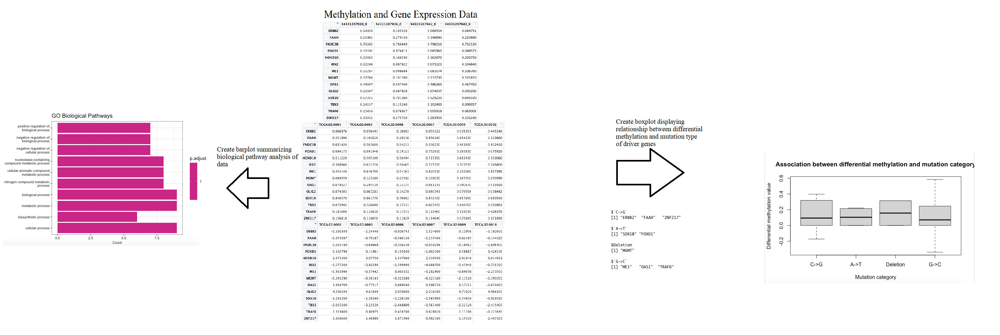

<!-- README.md is generated from README.Rmd. Please edit that file -->

```{r, include = FALSE}
knitr::opts_chunk$set(
  collapse = TRUE,
  comment = "#>",
  fig.path = "man/figures/README-",
  out.width = "100%"
)
```

# MethylBioPaths

<!-- badges: start -->
<!-- badges: end -->

## Description

`MethylBioPaths` is an R package for analyzing DNA methylation data, specifically the biological pathways that genes involved in driving differential methylation are involved in and the relationship between mutation types and differential methylation. The package was developed using R version 4.2.1 and Mac platform.

## Installation

To install the latest version of the package:

``` r
require("devtools")
devtools::install_github("Juan-De-Los-Rios/MethylBioPaths", build_vignettes = TRUE)
library("MethylBioPaths")
```

## Overview

``` r
ls("package:MethylBioPaths")
data(package = "MethylBioPaths") # optional
```
`MethylBioPaths` contains 2 functions that can be used to perform analysis of DNA methylation data. The *methylOverrep* function allows you to determine the genes driving the differential methylation of a sample chosen by the user and then perform a pathway analysis using those genes. The *methylMutationAssociation* function plots the relationship between each driver gene's impact on methylation and the category of mutation in which they are categorized. Refer to package vignettes for more details.

``` r
browseVignettes("MethylBioPaths")
```

An overview of the package is illustrated below.



## Contributions

The author of this package is Juan De Los Rios. *methylOverrep* and *methylMutationAssociation* both make use of the MethylMix function from the MethylMix package. *methylOverrep* makes use of the enrichGO function from the clusterProfiler package.

## References

Carlson M (2022). org.Hs.eg.db: Genome wide annotation for Human. R package version 3.15.0.

Chang W, Cheng J, Allaire J, Sievert C, Schloerke B, Xie Y, Allen J, McPherson J, Dipert A, Borges B (2022). _shiny: Web Application Framework for R_. R package version 1.7.3, <https://CRAN.R-project.org/package=shiny>.

Gevaert O (2022). MethylMix: Identifying methylation driven cancer genes. R package version 2.26.0.

T Wu, E Hu, S Xu, M Chen, P Guo, Z Dai, T Feng, L Zhou, W Tang, L Zhan, X Fu, S Liu, X Bo, and G Yu. clusterProfiler 4.0: A universal enrichment tool for interpreting omics data. The Innovation. 2021, 2(3):100141

R Core Team (2022). R: A language and environment for statistical computing. R Foundation for Statistical Computing, Vienna, Austria. URL https://www.R-project.org/.

## Acknowledgments

This package was developed as part of an assessment for 2022 BCB410H: Applied Bioinformatics course at the University of Toronto, Toronto, CANADA. MethylBioPaths welcomes issues, enhancement requests, and other contributions. To submit an issue, use the GitHub issues.
